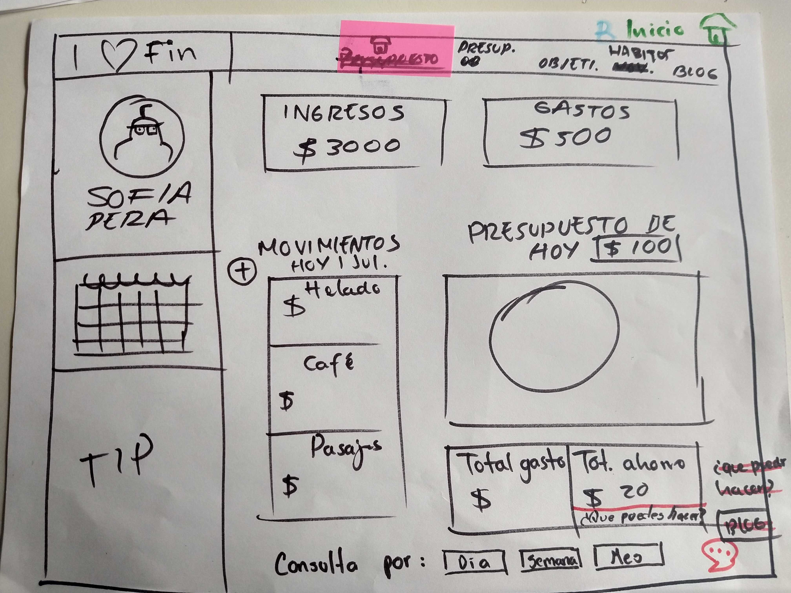
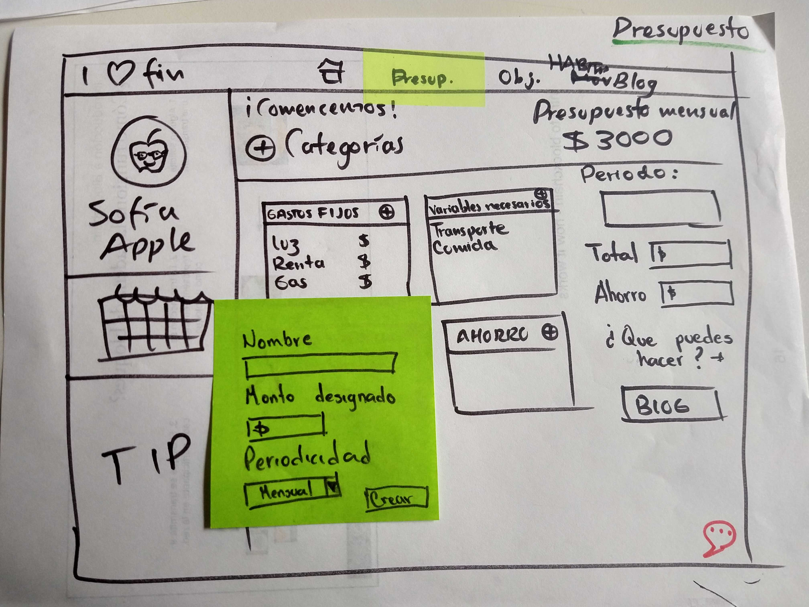
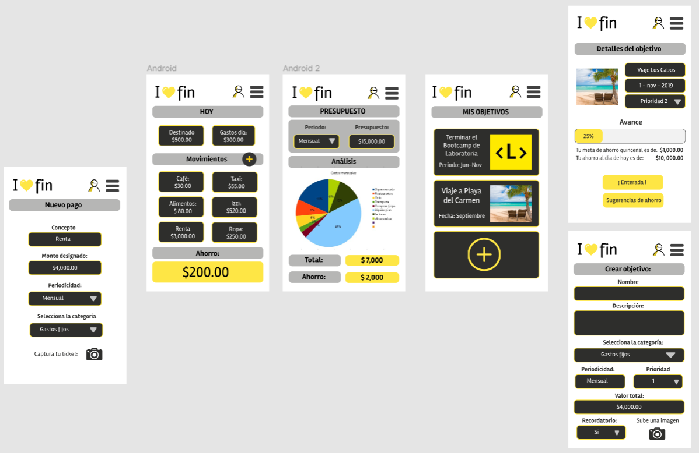

## Preámbulo

Tener una buena salud financiera significa contar con el dinero suficiente para cubrir gastos y tener ahorros que ayuden a afrontar imprevistos en el futuro. 

Con la revolución de las fintech (“fin” finanzas, “tech” tecnología) se han desarrollado multitud de aplicaciones que han llegado para quedarse. La comodidad, la rapidez y su fácil uso son los atributos principales que hace de ellas un complemento fundamental para las operaciones financieras del día a día. 

Al mismo tiempo, si bien existen muchas aplicaciones que ayudan a los usuarios a crear un presupuesto mensual, existe todavía un hueco. No hay aplicaciones que eduquen y ayuden a las personas a planificar sus ingresos, gastos y ahorros con miras a un futuro tanto a corto como a mediano plazo, y para visualizar la mejor estabilidad financiera que podrá tener en su vida.

### Objetivo

Crear un producto que resuelve el problema de muchas de las estudiantes del Bootcamp de Laboratoria.

Las estudiantes de Laboratoria sueñan con lograr su estabilidad y/o independencia financiera. Se podrá lograr con el tiempo con su nuevo sueldo como programadora o diseñadora de experiencia.  Pero, más allá de esperar un buen salario, pocas se han sentado a planificar cómo lograr sus metas financieras y proyectar cuándo lograrlas. 

Al recibir una oferta de trabajo, las estudiantes/egresadas no tienen quien les guíe a saber lo que les quedará libre del salario ofrecido, ni tienen un producto que les guíe a planificar cómo usar ese dinero “libre” para ir construyendo su ruta hacia la independencia financiera.

## Planeación del diseño

### Research

En esta etapa realizamos investigacion sobre cómo hacer un presupuesto, de que manera ahorrar, conceptos importantes y cómo motivarnos para lograr una buena salud financiera. Planteamos las siguientes preguntas para posteriormente definir de qué manera podríamos solucionar esas necesidades con nuestro producto:

1. ¿Cual es el problema?
2. ¿Como vamos a solucionarlo?
3. Que funcionalidades debe tener nuestra applicacion web para lograrlo

### User persona

Ivon es una estudiante activa de Laboratoria, tiene 30 años y es mamá de Samantha de 6 años. Actualmente vive de los ahorros obtenidos durante su periodo laboral y Samantha cuenta con pension alimenticia. El sueño de Ivon es lograr una estabilidad economica que le permita cumplir sus metas a corto, mediano y largo plazo. 

Sus motivaciones son darle a su hija una buena educación, viajar por lo menos una vez al año y comprar una casa.

Ivon no tiene muy claro si sus ahorros serán suficientes para estos 5 meses que estará desempleada y de qué manera puede administralos para lograrlo y aunque ha tratado de hacer un presupuesto no cuenta con una herramienta que le ayude a entender como realizarlo de forma exitosa, también le gustaría saber de que forma puede disminuir gastos y ahorrar para algún imprevisto o emergencia. 

## Historias de usuario

1. Poder planificar un presupuesto diario e ir ingresando los gastos generados para saber si lo cumplo y cuanto voy ahorrando
2. Poder planificar gastos de manera mensual para sobrellevar Bootcamp
3. Planificar metas/objetivos a corto, mediano y largo plazo para su seguimiento y cumplimiento.
5. Tener a la mano herramientas que ayuden a ampliar los metodos de ahorro y a conocer mas sobre conceptos necesarios para lograr una buena salud financiera. 

## Ideación

Durante el proceso de ideación utilizamos diferentes herramientas para obtener información e inspiración para poder diseñar nuestro prototipo de baja fidelidad.

-Benchmarking:

  1. www.condusef.gob.mx
  2. Fintonic
  3. Oingz

-Brainstorming:

  - Logo
  - Menu
  - Pantallas
  - Calendario
  - Chatbox
  - Blog
  - Interfaz Desktop y Mobile
 
 ## Prototipado

El primer prototipo diseñado para este proyecto considera las caracteristicas establecidas anteriormente buscando tener una interaccion inttuitiva y muy completa.

### Después de recibir feedback, deducimos las funciones de un modo más simplificado. Lo que nos permitió realizar el prototipo de alta fidelidad.

### Liga del prototipo (Figma)

  https://www.figma.com/file/GRIlyXfhVdrMi5TLKb4GzA/Salud_financiera?node-id=0%3A1

## Colaboradoras

### Zelina Cardenas Cardenas

    -UX Research
    -Wareframing
    -Prototipado Figma
    -Investigacion JS
    
### Blanca Ivon Garduño Crespo

    -UX Research
    -Wareframing
    -Logo
    -Creacion de repositorio GitHub
    -Maquetado HTML y CSS
    -Programación JS
    
### Sofia Mejia Muro

    -Scrum master
    -UX Research
    -Wareframing
    -Prototipado Marvel
    -Maquetado HTML y CSS
    -Programación JS
    
### Cassandra García Arellano

    -Ux Research
    -Modelo de negocio CANVAS
    -Wareframing
    -Presentación Drive

### Adriana Rosas Figueroa

    -Ux Research
    -Wareframing
    -Modelo de negocio CANVAS
    -Prototipado Figma
    -Prototipado Marvel
    -Presentación Drive
    -Observación CSS
